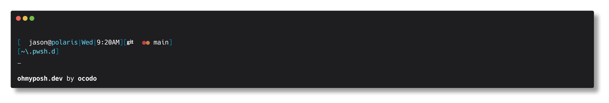

# .pwsh.d

## Latest update:

`profile-dependencies.json` can be added to `~/.pwsh.d/` see the example file to ensure required dependencies are available in a pwsh terminal profile session.

- - -

A simple init.d style execution pattern for `$profile`

clone this repo to `~/.pwsh.d` on windows and move `Microsoft.PowerShell_profile.ps1.copy_to_profile` to `$profile`.

Add your init scripts using the naming pattern `<name>.pwsh.ps1` to `~/.pwsh.d`

```
git clone git@gitcodo.hub:ocodo/.pwsh.d ~/.pwsh.d
mv ~/.pwsh.d/Microsoft.PowerShell_profile.ps1.copy_to_profile $profile
```

The default `profile.pwsh.ps1` is in place, and will use the oh-my-posh prompt in `ocodo.omp.yaml`, based on the prompt in `.zsh.d`



Fork and do as you will.

Made for pwsh v7

# TODO

- [ ] Git status amendments
  - [ ] merging
  - [ ] ahead
  - [ ] behind